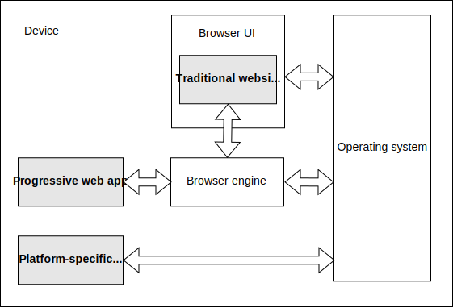

# 渐进式 Web 应用（PWA）
## 概念
渐进式 Web 应用（Progressive Web App，PWA）是一个使用 web 平台技术构建的应用程序，但它提供的用户体验就像一个特定平台的应用程序。

它像网站一样，PWA 可以通过一个代码库在多个平台和设备上运行。它也像一个特定平台的应用程序一样，可以安装在设备上，可以离线和在后台运行，并且可以与设备和其他已安装的应用程序集成。

# 传统网站
    传统上，网站更像是“用户访问的地方”，而不是“用户拥有的东西”。通常，一个网站：在用户不访问它时，在用户的设备上没有存在感，只能通过用户打开浏览器并导航到该网站来访问，而且高度依赖于网络连接。
    
然而，网站相比平台特定应用有一些好处，包括：

    单一代码库：因为 web 本身就是跨平台的，一个网站可以从一个代码库运行在不同的操作系统和设备类别上。
    通过 web 分发：web 是一个很好的分发平台。网站被搜索引擎索引，并且可以通过 URL 来分享和访问。一个网站可以分发而无需注册任何供应商的应用商店。

# PWA网站
 PWA 具有网站的优势，包括：
 
    PWA 是使用标准的 web 平台技术开发的，所以它们可以从单一代码库在多个操作系统和设备类上运行。
    PWA 可以直接通过 web 访问。

 PWA 也具有平台特定应用程序的许多优势，包括： 
    PWA 可以安装在设备上。这意味着：
     
    PWA 可以从平台的应用商店安装，也可以直接从 web 安装。 
    PWA 可以像平台特定的应用程序一样安装，并可以自定义安装过程。 
    一旦安装，PWA 会在设备上得到一个应用图标，与平台特定应用程序一样。 
    一旦安装，PWA 可以作为独立的应用程序启动，而不是作为浏览器中的网站。 
    PWA 可以在后台与离线操作：一个典型的网站只在被浏览器加载后才处于活动状态。PWA 可以： 
    在设备没有网络连接时工作。 
    在后台更新内容。 
    对来自服务器的推送消息做出响应。 
    使用操作系统的通知系统显示通知。 
    PWA 可以使用整个屏幕 (en-US)，而不是在浏览器 UI 中运行。 
    PWA 可以与设备集成，注册为共享目标和来源，并访问设备特性。 
    PWA 可以在应用商店以及通过 web 公开发布。 
## PWA 和浏览器
当你在浏览器中访问一个网站时，从视觉上可以明显看出网站是“运行在浏览器中的”。浏览器 UI 为网站提供了一个可见的框架，包括后退/前进按钮等 UI 功能和页面的标题。你的网站调用的 Web API 是由浏览器引擎实现的。   

PWA 通常看起来像平台特定应用程序——它们通常是在没有浏览器 UI 环绕的情况下显示的——但从技术上讲，它们仍然是网站。这意味着它们需要一个浏览器引擎，如 Chrome 或 Firefox 中的引擎，来管理和运行它们。对于平台特定应用程序，平台操作系统管理这个应用程序，提供其运行的环境。对于 PWA，浏览器引擎执行这一后台角色，就像它对普通网站所做的一样。

  

在我们的 PWA 文档中，我们有时会提到浏览器在后台发挥这种作用。例如，我们可能会说，“当收到推送通知时，浏览器会启动 PWA 的 service worker。”在这种情况下，浏览器的活动完全在后台。从 PWA 的角度来看，它也可以由操作系统启动。对于某些系统，如 Chromebook，“浏览器”和“操作系统”之间可能根本没有区别。

## PWA 的技术特性
因为 PWA 是网站，所以它们具有与任何其他网站相同的基本特性：至少有一个 HTML 页面，其可能会加载一些 CSS 和 JavaScript。与普通网站一样，页面加载的 JavaScript 具有一个全局的 Window 对象，并且可以通过该对象访问所有可用的 Web API。

## PWA和单页面应用
传统上，网站是作为相互链接的页面集合构建的。当用户从站点的一个页面点击链接到同一站点的另一个页面时，浏览器会将新页面作为一个完全新的实体加载，包括 HTML 和 HTML 加载的子资源，如 CSS 和 JavaScript。在单页应用中，站点由一个 HTML 页面组成，当用户点击内部链接时，由 JavaScript 从服务器获取新内容并更新页面的相关部分来处理。

单页应用可以提供更接近平台特定应用程序的用户体验，所以 PWA 通常以单页应用实现。特别是，单页应用使实现无缝的用户界面变得更加容易，在该用户界面中，用户被呈现一个单一、一致的页面，只更新页面相关部分以响应用户与应用程序的交互。

::: tip
然而，PWA 不必是单页应用，单页应用也不必是 PWA。
:::
## 渐进增强
虽然渐进增强是大多数网站的一个理想的属性，但对于 PWA 来说尤其重要，因为它们期望在广泛的设备上运行，并且通常使用可能不被所有浏览器支持的高级 Web API。

渐进增强的一个基本组成部分是，如果用户通过在浏览器中输入其 URL 的方式在网络上访问你的 PWA，则用户可以像访问普通网站一样与应用程序交互。但是如果浏览器可以安装它，则会提示用户安装它，并且该应用程序将作为设备上的新功能出现。

::: warning
PWA 应该对高级 API 执行特性检测并提供可接受的回退体验。
:::
例如，后台同步 API (en-US) 使 PWA 可以要求服务工作线程在设备连接时尽快发出网络请求。这个经典的用例是消息传递。假设用户编写了一条消息，但当用户尝试发送消息时，设备处于离线状态。后台同步 API 使设备能够在连上网后在后台发送消息。在不支持后台同步的设备上，该应用程序应该让用户知道消息无法发送，并给他们再次重试的机会。
