:rofl: HTTP知识点
## 前言 
::: tip
在前端开发中，性能一直都是被大家所重视的一点，然而判断一个网站的性能最直观的就是看网页打开的速度。其中提高网页反应速度的一个方式就是使用缓存。缓存技术一直一来在WEB技术体系中扮演非常重要角色，是快速且有效地提升性能的手段。
:::
::: tip
一个优秀的缓存策略可以缩短网页请求资源的距离，减少延迟，并且由于缓存文件可以重复利用，还可以减少带宽，降低网络负荷。
:::
::: tip
所以，缓存技术是无数WEB开发从业人员在工作过程中不可避免的一大问题。在产品开发的时候我们总是想办法避免缓存产生，而在产品发布之时又在想策略管理缓存提升网页的访问速度。了解浏览器的缓存命中原理，是开发WEB应用的基础，本文着眼于此，学习浏览器缓存的相关知识，总结缓存避免和缓存管理的方法，结合具体的场景说明缓存的相关问题。希望能对有需要的人有所帮助。
:::
# WEB缓存体系
 在实际WEB开发过程中，缓存技术会涉及到不同层、不同端，比如：用户层、系统层、代理层、前端、后端、服务端等，每一层的缓存目标都是一致的，就是尽快返回请求数据、减少延迟，但每层使用的技术实现是各有不同，面对不同层、不同端的优劣，选用不同的技术来提升系统响应效率。所以，我们首先看下各层的缓存都有哪些技术，都缓存哪些数据，从整体上，对WEB的缓存技术进行了解，如下图所示：

 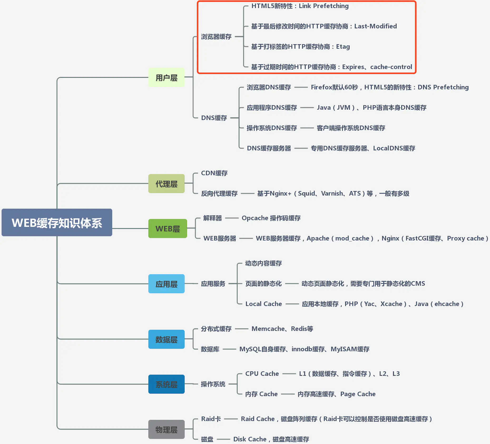
 
 ::: warning
 本篇文章重点讲的就是上面红色框部分缓存内容。
 :::
 # 认识浏览器缓存
 当浏览器请求一个网站的时候，会加载各种各样的资源，比如：HTML文档、图片、CSS和JS等文件。对于一些不经常变的内容，浏览器会将他们保存在本地的文件中，下次访问相同网站的时候，直接加载这些资源，加速访问

>这些被浏览器保存的文件就被称为缓存（不是指Cookie或者Localstorage）。

那么如何知晓浏览器是读取了缓存还是直接请求服务器？如下图网站来做个示例：

 
 
 第一次打开该网站后，如果再次刷新页面。会发现浏览器加载的众多资源中，有一部分size有具体数值，然而还有一部分请求，比如图片、css和js等文件并没有显示文件大小，而是显示了 `from dis cache` 或者 `from memory cache` 字样。这就说明了，该资源直接从本地硬盘或者浏览器内存读取，而并没有请求服务器。
 ::: tip
 浏览器启用缓存至少有两点显而易见的好处：（1）减少页面加载时间；（2）减少服务器负载；
 :::
 
浏览器是否使用缓存、缓存多久，是由服务器控制的。准确来说，当浏览器请求一个网页（或者其他资源）时，服务器发回的响应的「响应头」部分的某些字段指明了有关缓存的关键信息。下面看下，HTTP报文中与缓存相关的首部字段：

#### 1.通用首部字段（就是请求报文和响应报文都能用上的字段）
 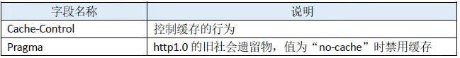
 
#### 2.请求首部字段
 
#### 3.响应首部字段
 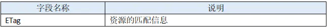
#### 3.实体首部字段
 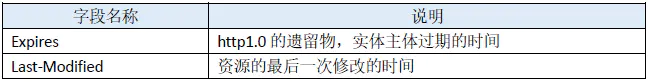
 
# 浏览器缓存机制
    根据上面四种类型的首部字段不同使用策略，浏览器中缓存可分为强缓存和协商缓存：
>(1）浏览器在加载资源时，先根据这个资源的一些http header判断它是否命中强缓存，强缓存如果命中，浏览器直接从自己的缓存中读取资源，不会发请求到服务器。比如：某个css文件，如果浏览器在加载它所在的网页时，这个css文件的缓存配置命中了强缓存，浏览器就直接从缓存中加载这个css，连请求都不会发送到网页所在服务器；
(2）当强缓存没有命中的时候，浏览器一定会发送一个请求到服务器，通过服务器端依据资源的另外一些http header验证这个资源是否命中协商缓存，如果协商缓存命中，服务器会将这个请求返回，但是不会返回这个资源的数据，而是告诉客户端可以直接从缓存中加载这个资源，于是浏览器就又会从自己的缓存中去加载这个资源；
(3）强缓存与协商缓存的共同点是：如果命中，都是从客户端缓存中加载资源，而不是从服务器加载资源数据；区别是：强缓存不发请求到服务器，协商缓存会发请求到服务器。
(4）当协商缓存也没有命中的时候，浏览器直接从服务器加载资源数据。
## 强缓存：Expires&Cache-Control
当浏览器对某个资源的请求命中了强缓存时，返回的HTTP状态为200，在chrome的开发者工具的network里面 size会显示为from cache，比如：京东的首页里就有很多静态资源配置了强缓存，用chrome打开几次，再用f12查看network，可以看到有不少请求就是从缓存中加载的：
 
::: warning
  ### 强缓存是利用Expires或者Cache-Control这两个http response header实现的，它们都用来表示资源在客户端缓存的有效期。
:::
Expires是HTTP 1.0提出的一个表示资源过期时间的header，它描述的是一个绝对时间，由服务器返回，用GMT格式的字符串表示，如：Expires:Thu, 31 Dec 2037 23:55:55 GMT，包含了Expires头标签的文件，就说明浏览器对于该文件缓存具有非常大的控制权。

例如，一个文件的Expires值是2020年的1月1日，那么就代表，在2020年1月1日之前，浏览器都可以直接使用该文件的本地缓存文件，而不必去服务器再次请求该文件，哪怕服务器文件发生了变化。

所以，Expires是优化中最理想的情况，因为它根本不会产生请求，所以后端也就无需考虑查询快慢。它的缓存原理，如下：

 1.浏览器第一次跟服务器请求一个资源，服务器在返回这个资源的同时，在response的header加上Expires的header，如：

 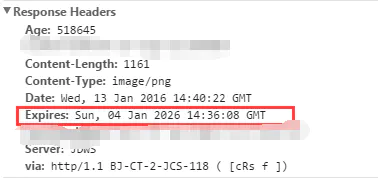
 
 2.浏览器在接收到这个资源后，会把这个资源连同所有response header一起缓存下来（所以缓存命中的请求返回的header并不是来自服务器，而是来自之前缓存的header）；
 
 3.浏览器再请求这个资源时，先从缓存中寻找，找到这个资源后，拿出它的Expires跟当前的请求时间比较，如果请求时间在Expires指定的时间之前，就能命中缓存，否则就不行

4.如果缓存没有命中，浏览器直接从服务器加载资源时，Expires Header在重新加载的时候会被更新

:::: tip
Expires是较老的强缓存管理header，由于它是服务器返回的一个绝对时间，在服务器时间与客户端时间相差较大时，缓存管理容易出现问题，比如：随意修改下客户端时间，就能影响缓存命中的结果。所以在HTTP 1.1的时候，提出了一个新的header，就是Cache-Control，这是一个相对时间，在配置缓存的时候，以秒为单位，用数值表示，如：Cache-Control:max-age=315360000，它的缓存原理是：
::::
1.浏览器第一次跟服务器请求一个资源，服务器在返回这个资源的同时，在response的header加上Cache-Control的header，如：

 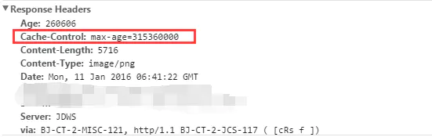
 
 2.浏览器在接收到这个资源后，会把这个资源连同所有response header一起缓存下来；
 
 3.浏览器再请求这个资源时，先从缓存中寻找，找到这个资源后，根据它第一次的请求时间和Cache-Control设定的有效期，计算出一个资源过期时间，再拿这个过期时间跟当前的请求时间比较，如果请求时间在过期时间之前，就能命中缓存，否则就不行；
 
 4.如果缓存没有命中，浏览器直接从服务器加载资源时，Cache-Control Header在重新加载的时候会被更新；

 Cache-Control描述的是一个相对时间，在进行缓存命中的时候，都是利用客户端时间进行判断，所以相比较Expires，Cache-Control的缓存管理更有效，安全一些。
 
 这两个header可以只启用一个，也可以同时启用，当response header中，Expires和Cache-Control同时存在时，Cache-Control优先级高于Expires：
  
  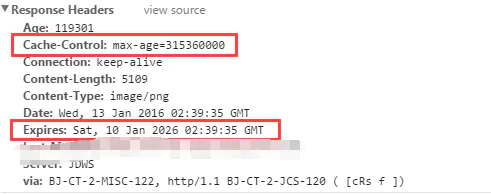
  
此外，还可以为 `Cache-Control` 指定 `public` 或 `private` 标记。如果使用 `private`，则表示该资源仅仅属于发出请求的最终用户，这将禁止中间服务器（如代理服务器）缓存此类资源。对于包含用户个人信息的文件（如一个包含用户名的 HTML 文档），可以设置 `private`，一方面由于这些缓存对其他用户来说没有任何意义，另一方面用户可能不希望相关文件储存在不受信任的服务器上。需要指出的是，`private` 并不会使得缓存更加安全，它同样会传给中间服务器（如果网站对于传输的安全性要求很高，应该使用传输层安全措施）。对于 `public`，则允许所有服务器缓存该资源。通常情况下，对于所有人都可以访问的资源（例如网站的 logo、图片、脚本等），`Cache-Control` 默认设为 `public` 是合理的。

## 协商缓存：Last-Modified&Etag
当浏览器对某个资源的请求没有命中强缓存，就会发一个请求到服务器，验证协商缓存是否命中，如果协商缓存命中，请求响应返回的http状态为304并且会显示一个Not Modified的字符串，比如你打开京东的首页，按f12打开开发者工具，再按f5刷新页面，查看network，可以看到有不少请求就是命中了协商缓存的：

  
  
  查看单个请求的Response Header，也能看到304的状态码和Not Modified的字符串，只要看到这个就可说明这个资源是命中了协商缓存，然后从客户端缓存中加载的，而不是服务器最新的资源：
  
 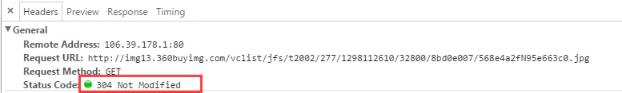

>协商缓存是利用的是【Last-Modified，If-Modified-Since】和【ETag、If-None-Match】这两对Header来管理的。

【Last-Modified，If-Modified-Since】的控制缓存的原理，如下：

1.浏览器第一次跟服务器请求一个资源，服务器在返回这个资源的同时，在response的header加上Last-Modified的header，这个header表示这个资源在服务器上的最后修改时间：
 
 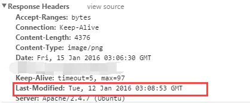
 
 2.浏览器再次跟服务器请求这个资源时，在request的header上加上If-Modified-Since的header，这个header的值就是上一次请求时返回的Last-Modified的值：
 
  
  
  3.服务器再次收到资源请求时，根据浏览器传过来If-Modified-Since和资源在服务器上的最后修改时间判断资源是否有变化，如果没有变化则返回304 Not Modified，但是不会返回资源内容；如果有变化，就正常返回资源内容。当服务器返回304 Not Modified的响应时，response header中不会再添加Last-Modified的header，因为既然资源没有变化，那么Last-Modified也就不会改变，这是服务器返回304时的response header：
  
  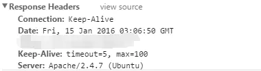
  
  4.浏览器收到304的响应后，就会从缓存中加载资源。
  
  5.如果协商缓存没有命中，浏览器直接从服务器加载资源时，Last-Modified Header在重新加载的时候会被更新，下次请求时，If-Modified-Since会启用上次返回的Last-Modified值。
   
   【Last-Modified，If-Modified-Since】都是根据服务器时间返回的header，一般来说，在没有调整服务器时间和篡改客户端缓存的情况下，这两个header配合起来管理协商缓存是非常可靠的，但是有时候也会服务器上资源其实有变化，但是最后修改时间却没有变化的情况，而这种问题又很不容易被定位出来，而当这种情况出现的时候，就会影响协商缓存的可靠性。所以就有了另外一对header来管理协商缓存，这对header就是【ETag、If-None-Match】。它们的缓存管理的方式是：
   
   1.浏览器第一次跟服务器请求一个资源，服务器在返回这个资源的同时，在response的header加上ETag的header，这个header是服务器根据当前请求的资源生成的一个唯一标识，这个唯一标识是一个字符串，只要资源有变化这个串就不同，跟最后修改时间没有关系，所以能很好的补充Last-Modified的问题：
     
  

  2.浏览器再次跟服务器请求这个资源时，在request的header上加上If-None-Match的header，这个header的值就是上一次请求时返回的ETag的值：

 
 
 3.服务器再次收到资源请求时，根据浏览器传过来If-None-Match和然后再根据资源生成一个新的ETag，如果这两个值相同就说明资源没有变化，否则就是有变化；如果没有变化则返回304 Not Modified，但是不会返回资源内容；如果有变化，就正常返回资源内容。与Last-Modified不一样的是，当服务器返回304 Not Modified的响应时，由于ETag重新生成过，response header中还会把这个ETag返回，即使这个ETag跟之前的没有变化：
   
   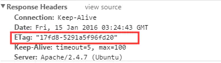
   
  4.浏览器收到304的响应后，就会从缓存中加载资源。
  
  Etag和Last-Modified非常相似，都是用来判断一个参数，从而决定是否启用缓存。但是ETag相对于Last-Modified也有其优势，可以更加准确的判断文件内容是否被修改，从而在实际操作中实用程度也更高。
  
  协商缓存跟强缓存不一样，强缓存不发请求到服务器，所以有时候资源更新了浏览器还不知道，但是协商缓存会发请求到服务器，所以资源是否更新，服务器肯定知道。大部分web服务器都默认开启协商缓存，而且是同时启用【Last-Modified，If-Modified-Since】和【ETag、If-None-Match】，比如apache:
  
  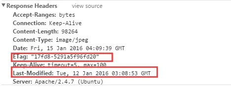
  
   如果没有协商缓存，每个到服务器的请求，就都得返回资源内容，这样服务器的性能会极差。
   
   【Last-Modified，If-Modified-Since】和【ETag、If-None-Match】一般都是同时启用，这是为了处理Last-Modified不可靠的情况。有一种场景需要注意：
   >分布式系统里多台机器间文件的Last-Modified必须保持一致，以免负载均衡到不同机器导致比对失败；
   分布式系统尽量关闭掉ETag(每台机器生成的ETag都会不一样）；
 
  比如，京东页面的资源请求，返回的repsonse header就只有Last-Modified，没有ETag：

  
  
协商缓存需要配合强缓存使用，上面这个截图中，除了Last-Modified这个header，还有强缓存的相关header，因为如果不启用强缓存的话，协商缓存根本没有意义。

 ## 缓存判断流程
 如果资源已经被浏览器缓存下来，在缓存失效之前，再次请求时，默认会先检查是否命中强缓存，如果强缓存命中则直接读取缓存，如果强缓存没有命中则发请求到服务器检查是否命中协商缓存，如果协商缓存命中，则告诉浏览器还是可以从缓存读取，否则才从服务器返回最新的资源。其浏览器判断缓存的详细流程图，如下：
 
 
 
